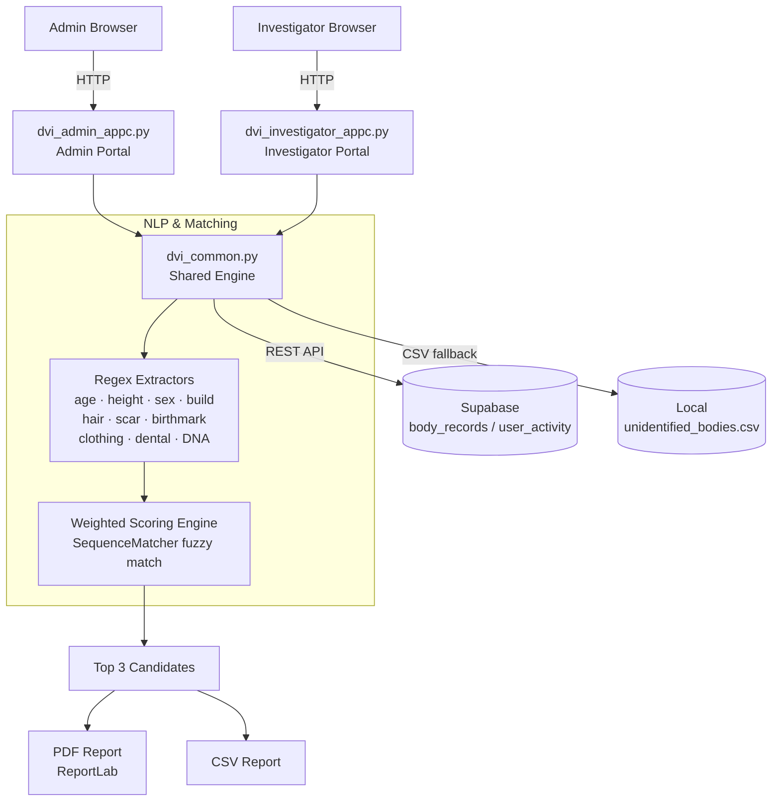

# Architecture

## System Architecture

The DVI Intelligence System is a dual-portal Streamlit application. Two separate entry points (Admin and Investigator) share a single common backend module. Persistence is handled by Supabase when configured, with a local CSV fallback for offline use.

## Components

| Component | File / Technology | Responsibility |
|---|---|---|
| Admin Portal | `dvi_admin_appc.py` / Streamlit | Database upload, investigation, full activity history |
| Investigator Portal | `dvi_investigator_appc.py` / Streamlit | Case investigation, personal history |
| Shared Engine | `dvi_common.py` / Python | Auth, NLP extraction, matching, reports, Supabase, theming |
| NLP Extraction | `dvi_common.py` — regex (`re`) | Parses free-text ante-mortem descriptions into structured fields |
| Matching Engine | `dvi_common.py` — `difflib.SequenceMatcher` | Scores every body record against extracted ante-mortem info |
| Report Builder | `dvi_common.py` — ReportLab / pandas | Generates A4 PDF and CSV reconciliation reports |
| Database | Supabase (PostgREST REST) / local CSV | Stores body records (`body_records`) and audit log (`user_activity`) |
| Auth | `dvi_common.py` — `hmac.compare_digest` | Role-based login gate with brute-force lockout and session timeout |

## Data Flow

### Investigation workflow

1. User (admin or investigator) enters a free-text description **or** fills in the structured form.
2. [`extract_info_from_text()`](../src/dvi_common.py:664) runs ten regex extractors over the text, producing a structured dict of ante-mortem attributes (age, height, sex, build, hair, scar, birthmark, clothing, dental, DNA reference).
3. [`run_matching()`](../src/dvi_common.py:782) iterates over every row in the body-records database and calls [`calculate_match()`](../src/dvi_common.py:690) per row.
4. `calculate_match()` computes a weighted score (0–100%) across all available factors. Numeric fields (age, height) use range containment; categorical fields (sex) use exact match; text fields (build, hair, scars, etc.) use `SequenceMatcher` fuzzy similarity with a 0.60 threshold.
5. Results are sorted descending by score. The top 3 candidates are stored in session state and displayed with match/conflict breakdowns.
6. The investigator exports a **PDF** (ReportLab A4) or **CSV** reconciliation report, which is passed to the forensic team for formal confirmation.
7. [`log_activity()`](../src/dvi_common.py:477) records the event to Supabase (`user_activity` table) or, if Supabase is unavailable, to in-memory session state.

### Database upload workflow (Admin only)

1. Admin uploads a CSV file from the Dashboard.
2. [`save_database()`](../src/dvi_common.py:448) validates the 14 required columns, writes the file locally, then bulk-inserts rows into Supabase in batches of 500 (replacing the previous dataset).
3. The Streamlit `@st.cache_data` cache is cleared, triggering a fresh load on the next query.

## Matching Weight Table

| Factor | Weight | Match Method |
|---|---|---|
| DNA Reference | 25 | Exact string match |
| Age | 15 | Range containment (`Estimated_Age_Min` – `Estimated_Age_Max`) |
| Sex | 15 | Exact match (case-insensitive) |
| Scar | 10 | Fuzzy similarity ≥ 0.60 |
| Birthmark | 10 | Fuzzy similarity ≥ 0.60 |
| Dental | 10 | Fuzzy similarity ≥ 0.60 |
| Height | 10 | Range containment (`Estimated_Height_Min` – `Estimated_Height_Max`) |
| Build | 5 | Fuzzy similarity ≥ 0.60 |
| Hair | 5 | Fuzzy similarity ≥ 0.60 |
| Clothing | 5 | Fuzzy similarity ≥ 0.60 |

The final score is `(sum of earned points) / (sum of weights for factors that were provided) × 100`. Factors not present in the ante-mortem input are excluded from both numerator and denominator, so a partial description is not penalised for missing data.

## Security Considerations

- Credentials are stored in `src/.streamlit/secrets.toml` (gitignored) and never committed.
- Login uses `hmac.compare_digest` to prevent timing-based credential attacks.
- Brute-force protection: 5 failed attempts trigger a 60-second lockout.
- Sessions expire after 15 minutes of inactivity.
- The Supabase `service_role_key` is used server-side only (never exposed to the browser).
- All outputs carry a "decision support only — forensic confirmation required" disclaimer in accordance with INTERPOL DVI protocol.

## Scalability Notes

The Streamlit server is stateless between sessions; horizontal scaling is straightforward behind a load balancer. The main bottleneck at scale is the in-process matching loop — it iterates over every row in Python for each query. For databases beyond ~10,000 records this should be moved to a SQL query with indexed column filters (age range, sex) to pre-filter candidates before scoring. Supabase (PostgreSQL) already supports this; the REST layer would need parameterised pre-filter calls added to [`run_matching()`](../src/dvi_common.py:782).
